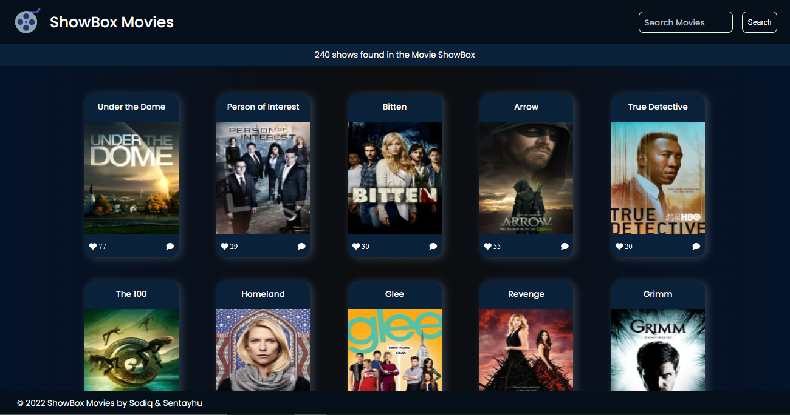

# ShowBox Movie Database
> Search for info about your favorite movies and tv shows

### Built With

- Major languages: HTML, CSS, JavaScript
- Frameworks: N/A
- Technologies used: Webpack, API

### You can view it live [here](https://deyemiobaa.github.io/Movie-Database/)

### Watch our project presentation [here](https://youtu.be/5oZ5C4DJtag)



### Prerequisites

- Understand HTML/CSS and JavaScript

### Install

- A code editor (preferably VSCode)
- A browser
- Node.js (to run javascript files locally)
- LiveServer (to load javascript modules)

### Getting Started

To get a local copy up and running follow these simple example steps.
- Open git bash on local computer
- clone the repo with: 
```
git clone  <https://github.com/deyemiobaa/Movie-Database.git>
```
- run ```cd Movie-Database``` to enter the project folder
- run ```npm i``` to install all dependencies
- run ```npm run build``` to bundle the project with webpack, and
- run ```npm start``` to launch the application
  Runs the app in the development mode.\
   Open [http://localhost:8080](http://localhost:8080) to view it in the browser.
- run ``` npm test ``` To run Unit test run:

### Authors

👤 **Sodiq**

- GitHub: [@deyemiobaa](https://github.com/deyemiobaa)
- Twitter: [@deyemiobaa](https://twitter.com/deyemiobaa)
- LinkedIn: [Sodiq Aderibigbe](https://linkedin.com/in/sodiqa)

👤 **Sentayhu**

- GitHub: [@sentayhu19](https://github.com/sentayhu19)
- LinkedIn: [Sentayhu Berhanu](https://www.linkedin.com/in/sentayhu-berhanu-6376579a/)

### 🤝 Contributing

Contributions, issues, and feature requests are welcome!

Feel free to check the [issues page](https://github.com/deyemiobaa/Movie-Database/issues).


### Show your support

Give a ⭐️ if you like this project!

### 📝 License

This project is [MIT](LICENSE) licensed.
